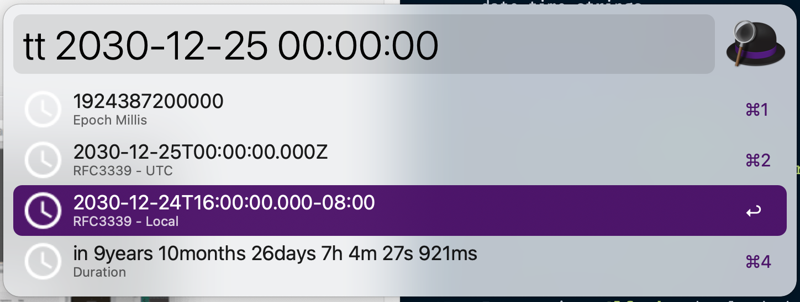

# timeturner

Command line utility for manipulating date-time strings

## Installation

To install with **Homebrew**:

`brew install jrduncans/timeturner/timeturner`

To install with **cargo**:

`cargo install timeturner`

For use in **Alfred** download the [latest release](https://github.com/jrduncans/timeturner/releases/latest)

## Usage

`timeturner 1575149020890`

```text
2019-11-30T21:23:40.890Z
2019-11-30T13:23:40.890-08:00
1575149020890
3years 3months 21days 22h 29m 35s 867ms ago
```

`timeturner 2019-11-30T13:27:45-08:00`

```text
2019-11-30T21:27:45.000Z
2019-11-30T13:27:45.000-08:00
1575149265000
3years 3months 21days 22h 29m 13s 981ms ago
```

`timeturner '03 Feb 2020 01:03:10.534'`

```text
2020-02-03T01:03:10.534Z
2020-02-02T17:03:10.534-08:00
1580691790534
3years 1month 18days 16h 1m 26s 481ms ago
```

`timeturner 1575149020890 -d days`

```text
2019-11-30T21:23:40.890Z
2019-11-30T13:23:40.890-08:00
1575149020890
3years 3months 21days 22h 34m 3s 15ms ago
1209.0 days ago
```

### Timezone options

Inputs without timezone information are assumed to be UTC by default. Use `--input-timezone` to treat them as a different zone:

`timeturner --input-timezone America/New_York '2019-11-30 16:23:40'`

```text
2019-11-30T21:23:40.000Z
2019-11-30T13:23:40.000-08:00
1575149020000
3years 3months 21days 22h 29m 35s ago
```

The zoned output line uses your system's local timezone by default. Use `--output-timezone` to specify a different one:

`timeturner --output-timezone Asia/Tokyo 1575149020890`

```text
2019-11-30T21:23:40.890Z
2019-12-01T06:23:40.890+09:00
1575149020890
3years 3months 21days 22h 29m 35s 867ms ago
```

Both flags accept IANA timezone names (`America/New_York`, `Europe/London`) and fixed offsets (`-05:00`, `+09:30`).

### Selecting outputs

Use `--outputs` / `-o` to choose which lines are produced. The available values are:

| Value      | Output                              |
|------------|-------------------------------------|
| `utc`      | RFC3339 in UTC                      |
| `zoned`    | RFC3339 in the local/specified zone |
| `seconds`  | Epoch seconds                       |
| `millis`   | Epoch milliseconds                  |
| `nanos`    | Epoch nanoseconds                   |
| `duration` | Human-readable duration since/until |

Default: `utc,zoned,millis,duration`

`timeturner -o seconds,nanos 1575149020890`

```text
1575149020
1575149020890000000
```

`--outputs` and `--duration-unit` are independent — `-d` always appends its line:

`timeturner -o utc -d days 1575149020890`

```text
2019-11-30T21:23:40.890Z
1209.0 days ago
```

## Alfred Usage


