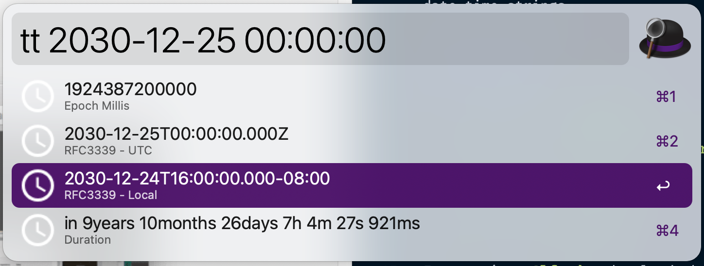

# timeturner

Command line utility for manipulating date-time strings

## Installation

To install with **Homebrew**:

`brew install jrduncans/timeturner/timeturner`

To install with **cargo**:

`cargo install timeturner`

For use in **Alfred** download the [latest release](https://github.com/jrduncans/timeturner/releases/download/v2.0.0/timeturner.alfredworkflow)

## Usage

`timeturner 1575149020890`

```text
2019-11-30T21:23:40.890Z
2019-11-30T13:23:40.890-08:00
1575149020890
3years 3months 21days 22h 29m 35s 867ms ago
```

`timeturner 2019-11-30T13:27:45-08:00`

```text
2019-11-30T21:27:45.000Z
2019-11-30T13:27:45.000-08:00
1575149265000
3years 3months 21days 22h 29m 13s 981ms ago
```

`timeturner '03 Feb 2020 01:03:10.534'`

```text
2020-02-03T01:03:10.534Z
2020-02-02T17:03:10.534-08:00
1580691790534
3years 1month 18days 16h 1m 26s 481ms ago
```

`timeturner 1575149020890 -d days`

```text
2019-11-30T21:23:40.890Z
2019-11-30T13:23:40.890-08:00
1575149020890
3years 3months 21days 22h 34m 3s 15ms ago
1209.0 days ago
```

## Alfred Usage


